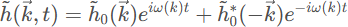
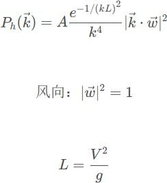

# 基于opengl的海滩渲染

### 快速开始

```bash
mkdir build
cd build
cmake ..
cmmake --build .
```

### 纹理坐标

左下角为 `(0,0)`，纹理映射在顶点上，表示该顶点属于纹理的哪一个部分

### 快速傅里叶变换

https://www.slembcke.net/blog/WaterWaves/

N个序列，第一个波的波长为平均水高/流速，第2，3...个为N/1，N/2...，因此要注意N/2后面的波实际上是反向的

水面的速度正比于$\sqrt{波长}$

摆线波

```javascript
let phase = x/wavelength - time/wavelength;
x_out = x - amplitude*sin(phase);
y_out = amplitude*cos(phase);
```

摆线波混合

```java
x_out = x, y_out = 0;

let amp0 = 3.0, len0 = 9;
x_out -= amp0*sin(x/len0 - time/sqrt(len0));
y_out += amp0*cos(x/len0 - time/sqrt(len0));

let amp1 = 0.5, len1 = 2;
x_out -= amp1*sin(x/len1 - time/sqrt(len1));
y_out += amp1*cos(x/len1 - time/sqrt(len1));

```

FFT

```
	for(let i = 0; i <= waves.n/2; i++){
		let phase = 5*time*sqrt(i);
		let phase_complex = complex(cos(phase), sin(phase));
	
		let p = complex_multiply(waves[i], phase_complex);
		waves_x[i] = complex(-p.im, p.re);
		waves_y[i] = p;
	
		let j = (waves.n - i) % waves.n;
		let q = complex_multiply(waves[j], phase_complex);
		waves_x[j] = complex(q.im, -q.re);
		waves_y[j] = q;
	}
	water_x = inverse_fft(waves_x);
	water_y = inverse_fft(waves_y);

```

菲利普频谱



h(k,t)即为waves

因此海洋的idft如下：




顺风的能量增大
