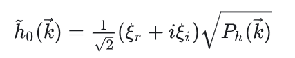
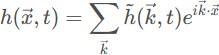
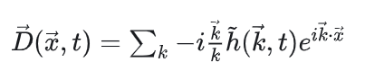

# 实验报告

### 光源

这里设置了一个dirLight和四个点光源，后面阴影贴图就是基于dirLight（海边主要是太阳光，太阳光近似平行光）。

### 水体

#### 反射和折射

反射和折射的原理都是通过在一个角度对场景进行渲染，然后创建一个帧缓冲保存到纹理中，然后渲染水体时再将纹理渲染到水面上

渲染的代码见 `utils/render.h/RenderWaterRefraction()`和 `utils/render.h/RenderWaterReflection()`

反射需要将摄像机根据水平面进行对称 `y=2*waterHeight-camPos.y`；折射摄像机不用动，但是需要渲染深度纹理，然后可以通过地面到水面的距离来渲染颜色

渲染水体颜色时，需要考虑fresnel系数，当入射角越大，反射光越强，否则折射光越强，见 `background\water.fs`可以看到 `vec3 finalColor = mix(refraction, reflection, fresnel *0.6);`

反射需要blin-phong的漫反射、镜面、环境系数相乘，然后折射颜色要和深度相符合，以及水的alpha系数（透明度），当水越深时越暗，最后折射和反射混合，再将最终颜色和深度颜色混合

折射还可以根据水面波纹进行扭曲，显得更真实（`vec2 refractTexCoords = ndc *0.5+0.5+ norm.xz *0.02;`）

对于水下，水下没有反射了，直接将折射的颜色和蓝色混合得到最终颜色

水下还有需要注意的是，需要给天空盒和地面增加雾化，天空盒就是直接变成深色，地面根据与摄像机的远近渲染颜色（越远越看不清）

```cpp
//beach-render/background/terrain.fs
float fogFactor = clamp((fogEnd - dist) / (fogEnd - fogStart), 0.0, 1.0);
FragColor = mix(fogColor, FragColor, fogFactor);
```

#### 水面波纹

水面波纹我查阅了很多资料，发现主流的是通过菲利普频谱用FFT渲染波浪gerstner波

##### gerstner波

这种方法是基于统计学得到的，因为海面的波纹近似摆线波，用多个摆线波叠加来模拟海浪波形，摆线波和正弦波最大的区别就是x和z会进行圆周运动，y进行垂直运动

先生成菲利普频谱


菲利普频谱类似于能量，顺风的能量增大，因此振幅就会更明显；k为采样点

根据菲利普频谱可以得到$h_0$初始频谱，然后得到每个



水面的速度为于$\sqrt{g*\lambda}$


其中h(k,t)即为waves

因此海洋的idft如下：



水平位移如下：



然后可以通过fft实现加速，然后海面的发现通过直接对 `h(x,t)`求导，可以得到如下公式

$$
\vec{N} = \mathrm{normalize}\left( -\nabla h_x(\vec{x}, t),\ 1,\ -\nabla h_z(\vec{x}, t) \right)
$$

```cpp
//background\waterplane_gerstner.h
float omega = std::sqrt(9.81f * k_length);
float phase = omega * time;
Complex phase_exp(std::cos(phase), std::sin(phase));

int m_conj = (N - m) % N;
int n_conj = (N - n) % N;
int conj_index = m_conj * N + n_conj;

// h̃(k, t)
waves[index] = h0[index] * phase_exp 
                + std::conj(h0[conj_index]) * std::conj(phase_exp);

// 位移频谱: D = -i * (k/|k|) * h̃
Complex i_unit(0.0f, 1.0f);
glm::vec2 k_norm = K / k_length;

waves_x[index] = -i_unit * k_norm.x * waves[index];
waves_z[index] = -i_unit * k_norm.y * waves[index];
waves_y[index] = waves[index];

// 斜率频谱: S = i * k * h̃
// ∂h/∂x ←→ i·k_x·h̃
slopes_x[index] = i_unit * K.x * waves[index];
// ∂h/∂z ←→ i·k_z·h̃
slopes_z[index] = i_unit * K.y * waves[index];
```

之后对waves数组进行IFFT2D

需要注意归一化，以及法线朝向y轴正半轴方向

```cpp
float scale = 1.0f / (N*N);
for (int i = 0; i < N * N; i++) {
    data[i] *= scale;
}
```

##### 噪声纹理贴图

因为海浪其实是可以提前算出来的，而且该傅里叶变换是有周期的，因此我们可以提前渲染一个周期的海面波纹高度图，然后循环播放，这里用到了3D噪声纹理存储(x,z,t)的y轴

代码见 `background\ocean_fft_baker.h`和 `background\waterplane_baked.h`

```cpp
float k_min =  M_PI / L;
float omega_max = std::sqrt(9.81f * k_min);
float minPeriod = 2.0f * M_PI / omega_max; 
//minperiod代表一个周期
```

见water.vs

```cpp
vec3 displacement = texture(displacementMap, uvw).xyz;
vec3 displacedPos = aPos + displacement;//应用海面波浪高度图
```

### 模型导入和阴影贴图

模型的导入，是通过多个网格（包括贴图，顶点坐标和顶点索引）合并得到的，见 `model/model.h`，不过我下载的.obj文件是嵌入式文件，需要特殊处理。

增加 `GameObject`存储一个model物体，增加静态变量存储所有游戏物体（用于计算阴影时渲染场景）

阴影渲染是摄像机在光源的方向然后渲染场景，获得深度贴图，后面在地面时，如果比深度贴图深，那么就说明被遮挡了，然后渲染阴影颜色

```cpp
// 获取最近点的深度（从光的角度）
float closestDepth = texture(shadowMap, projCoords.xy).r; 
// 获取当前片段深度
float currentDepth = projCoords.z;
```

然后增加一点偏移防止失真，增加PCF软投影（平滑边缘），减少锯齿块。

### 地面高度图

为了实现沙滩的纹理和地形，我下载了一张高度图和纹理照片，纹理通过重复10次来使分辨率更高，地面的渲染是通过绘制N*M的网格实现的，然后给(x,z)附上高度图的高度y，法线可以通过三角形平面计算

### 摄像机类


### 参考资料

[ 基于OpenGL的动态水面模拟 - 知乎](https://zhuanlan.zhihu.com/p/658797739)

[LearnOpenGL CN](https://learnopengl-cn.github.io/)

[water wave simulation](https://www.slembcke.net/blog/WaterWaves/)

[KoonanHyakukeiZu/2020-ZJUCG-Final-Project](https://github.com/KoonanHyakukeiZu/2020-ZJUCG-Final-Project)

https://zhuanlan.zhihu.com/p/95482541
